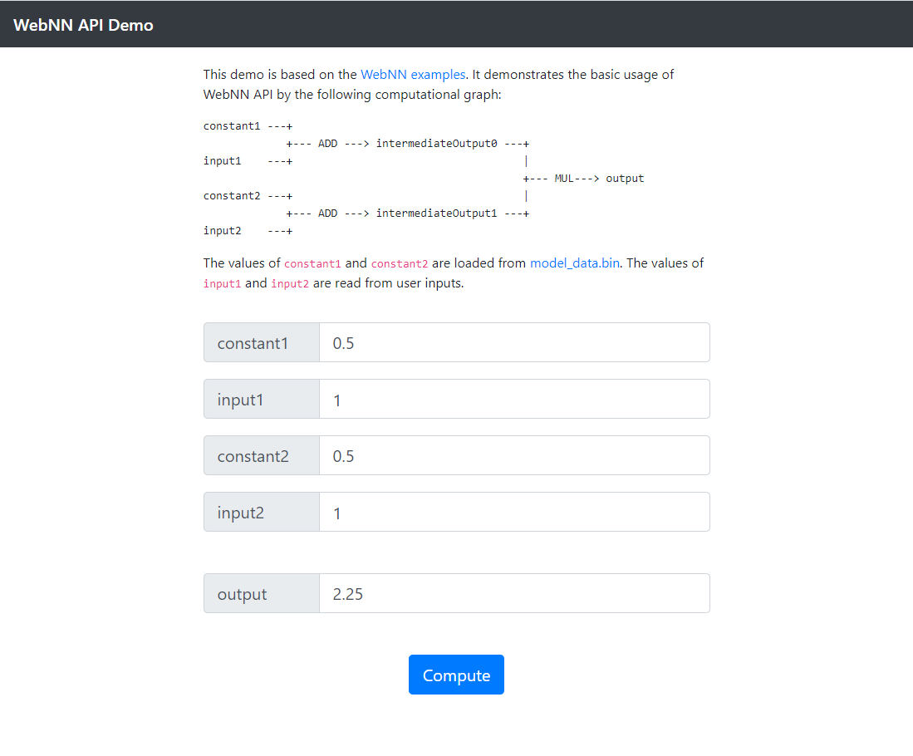

WebNN API Sample
======
This sample is based on the [WebNN examples](https://webmachinelearning.github.io/webnn/#examples).

It demonstrates basic usages of WebNN API with a simple model that consists of three operations: two additions and a multiplication.

The sums created by the additions are the inputs to the multiplication. In essence, we are creating a graph that computes: (constant1 + input1) * (constant2 + input2).
```js
constant1 ---+
             +--- ADD ---> intermediateOutput0 ---+
input1    ---+                                    |
                                                  +--- MUL---> output
constant2 ---+                                    |
             +--- ADD ---> intermediateOutput1 ---+
input2    ---+
```

Two of the four tensors, constant1 and constant2 being added are constants, defined in the model. They represent the weights that would have been learned during a training process, loaded from model_data.bin.

The other two tensors, input1 and input2 will be inputs to the model. Their values will be provided when we execute the model. These values can change from execution to execution.

The model then has 7 operands:
- 2 tensors that are inputs to the model. These are fed to the two ADD operations.
- 2 constant tensors that are the other two inputs to the ADD operations.
- 2 intermediate tensors, representing outputs of the ADD operations and inputs to the MUL operation.
- 1 model output.

Screenshots
-----------
